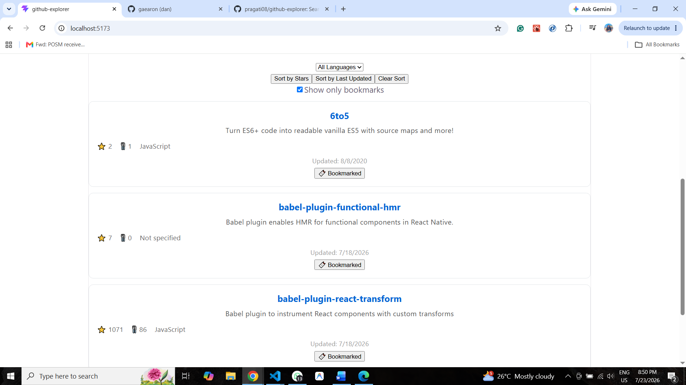

# GitHub Explorer

A React app to search GitHub users, view their profile and repositories, filter by language, sort by stars or recent activity, and bookmark favorite repos — with bookmarks persisted across sessions.

**Live Demo:** https://githubexplorer-jet.vercel.app/
**Repo:** https://github.com/pragati08/github-explorer.git

## Features

- 🔍 Search any GitHub username and view their profile (example: gaearon)
- 📦 Browse their public repositories
- 🗂️ Filter repos by programming language
- ⭐ Sort by star count or most recently updated
- 🔖 Bookmark repos, persisted via localStorage
- ⚡ Handles loading, error, and empty states gracefully

## Tech Stack

- React (Vite)
- Axios
- GitHub REST API
- localStorage for persistence
- Deployed on Vercel

## Architecture Notes

- Data fetching is abstracted into reusable custom hooks (`useGitHubUser`, `useGitHubRepos`), decoupling API logic from UI components
- Filtering, sorting, and bookmark-visibility are implemented as **derived state** — computed fresh from source state on every render, rather than duplicated and manually synced
- Bookmark state is lifted to the top-level `App` component and passed down via props, since it needs to be shared across the repo list

## Getting Started

1. Clone the repo:
   \`\`\`bash
   git clone https://github.com/pragati08/github-explorer.git
   cd github-explorer
   \`\`\`

2. Install dependencies:
   \`\`\`bash
   npm install
   \`\`\`

3. Run locally:
   \`\`\`bash
   npm run dev
   \`\`\`

4. Open `http://localhost:5173` in your browser

## Known Limitations

- Uses GitHub's unauthenticated API (60 requests/hour rate limit) — no personal access token integration yet
- No pagination — only the first page of repos (30) is fetched
- No automated tests

## Screenshots

### Profile & Search

